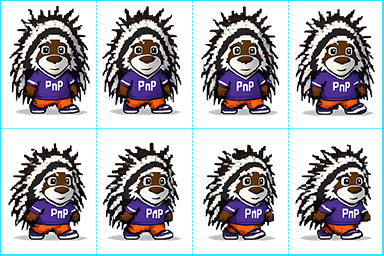
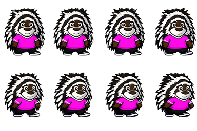
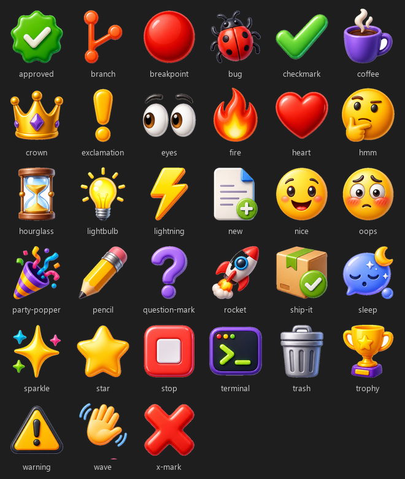

# Contributing to PnP Community Pets

Thanks for wanting to contribute! This project is built by and for the M365 and Power Platform community. New mascot sprites, bug fixes, themes, and doc improvements are all welcome — see the table below for where to start with each.

---

## Ways to Contribute

| Contribution type | Where to start |
|---|---|
| New mascot | No code required. See [Adding a New Mascot](#adding-a-new-mascot) below |
| New theme | Add a `ThemeDefinition` to `src/themes/ThemeManager.ts` |
| Bug fix | Open an issue, then submit a PR |
| New feature | Open a GitHub Discussion first so we can align before you build |
| Docs improvement | Submit a PR directly, no issue needed |
| Badge/logo integration | Coming soon. Open a GitHub Discussion if you want to help shape it |
| Emote | No code required. See [Adding an Emote](#adding-an-emote) below |

---

## Dev Setup

```bash
# 1. Clone the repo
git clone https://github.com/PopWarner/pnp-community-pets-vscode

# 2. Install dependencies
npm install

# 3. Start the TypeScript compiler in watch mode
npm run watch

# 4. Press F5 in VS Code to launch the Extension Development Host
#    The panel appears under the Explorer sidebar automatically
```

---

## Adding a New Mascot

> **Original community mascots are always welcome.** Your own character is great, no prior approval needed. If you're submitting something as an *official* mascot tied to a specific brand or program, link the official source so the art and colors can be verified. Not sure if something qualifies, or want feedback before you build? Open a GitHub Discussion, happy to help.

Mascots are entirely no-code. Each one lives in its own folder under `media/pets/<your-mascot>/` with a `mascot.json` manifest describing it. The extension discovers and registers every folder automatically on startup, so you never touch a `.ts` file.

```text
media/pets/my-mascot/
├── mascot.json
└── sprite-sheet.png
```

Reference [mascot.schema.json](mascot.schema.json) at the repo root from your `mascot.json`'s `$schema` field to get autocomplete and validation in VS Code as you write it.

### Step 1: Pick a sprite format

**PNG sprite sheet is the recommended standard.** It's the format we've tested end-to-end, it's the easiest to generate with AI tools, and it's the only one that currently supports the color-tinting feature.

#### PNG sprite sheet (recommended)

A single PNG grid, 4 columns × 2 rows:

```text
+--------+--------+--------+--------+
| idle 1 | idle 2 | idle 3 | idle 4 |  ← row 0
+--------+--------+--------+--------+
| walk→1 | walk→2 | walk→3 | walk→4 |  ← row 1
+--------+--------+--------+--------+
```

Walking left is generated automatically by mirroring row 1, so you don't need to draw it separately.

Recommended canvas: 384×256 px total (96×128 px per frame). This is the size we've tested and confirmed looks crisp at the in-panel display size.

[templates/README.md](templates/README.md) has a grid template, a working reference sprite sheet, and an AI prompt template: everything you need to build your first sprite sheet from scratch. Draw your mascot directly on the template and export with the guide lines still in the image; no layer cleanup required. Just keep your character a few pixels clear of each gridline, and set `"framePadding": 3` in your manifest (see below) so the extension crops those lines back out automatically.



```json
{
  "$schema": "../../mascot.schema.json",
  "name": "My Mascot",
  "description": "Short description shown in the spawn picker",
  "type": "png-sheet",
  "src": "sprite-sheet.png",
  "framesPerRow": 4,
  "frameWidth": 64,
  "frameHeight": 85,
  "framePadding": 3,
  "tags": ["community"]
}
```

`frameWidth`/`frameHeight` control the *display* size on the canvas. The actual pixel crop is calculated automatically from your image's real dimensions, so you don't need to hit an exact pixel count.

`framePadding` tells the extension how many pixels to crop in from each cell's edge before displaying it, which is what makes it safe to leave the grid template's guide lines baked into your exported sprite sheet. `3` is the value we've tested and confirmed works well with our template; if you still see a sliver of a line, try bumping it up by 1, and if your mascot looks clipped at the edges, give your art a bit more clearance from the gridlines rather than lowering the padding.

#### SVG frames (legacy/example format)

Supported, but currently only demonstrated with a single static frame (see `media/pets/parker/`). Without real per-frame walk-cycle art, an SVG mascot won't actually animate. Only use this format if you're prepared to supply a true frame sequence (an array of SVG files per animation state).

#### Animated GIF

One looping GIF per animation state (`idle`, `walkRight`, optional `walkLeft`). The browser drives the frame timing internally, so there's no frame-grid math, but this path is less tested than the PNG sprite sheet. Recommended spec: transparent background, 128×128 px, ~8 fps.

---

### Step 2: Make it color-tintable (optional)

Users can pick a custom color for any area of your mascot you mark as tintable, for example Parker's shirt. This only works with the PNG sprite sheet format.

Paint the area you want to be colorable with a flat chroma-key color, pure magenta, `#FF00FF`. It's the same "green screen" idea used in film, just magenta instead of green since it's far less likely to appear naturally in character art (unlike green, which shows up in nature-themed mascots). At draw time, the extension finds every pixel matching that color and swaps it for whichever color the user picked.

Design guidance:

- Use flat, hard-edged fills for the chroma area. Avoid soft brushes or heavy anti-aliasing at the boundary; blended/feathered edges leave a thin fringe of the original chroma color that won't get replaced cleanly.
- Don't use magenta anywhere else in your art (eyes, accessories, etc.). Anything matching the chroma color gets swapped, intentional or not.

```json
{
  "tintable": true,
  "chromaColor": "#FF00FF",
  "defaultTintColor": "#7B48CC"
}
```

- `chromaColor`: the color you painted (defaults to `#FF00FF` if omitted)
- `defaultTintColor`: fallback color used when the mascot spawns automatically on startup (no user prompt happens then), so it's never seen with the raw chroma color unless someone deliberately picks "no tint" from the spawn picker

Real examples: [media/pets/parker-chroma/](media/pets/parker-chroma/) and [media/pets/bit-chroma/](media/pets/bit-chroma/) are working tintable mascots.



The magenta `#FF00FF` shirt above is the raw chroma-key source. At spawn time, the extension replaces every pixel of that color with whichever color the user picks (see the [Screenshots section](README.md#screenshots) in the README for the picker itself).

---

### Step 3: Optional manifest fields

```json
{
  "hidden": false,
  "unlockedByBadgeId": "some-credly-badge-id",
  "tags": ["community", "featured"]
}
```

- `hidden`: excludes the mascot from the spawn picker while still allowing direct selection via the `pnpPets.mascot` setting. Useful for staging a mascot before it's ready to show off.
- `unlockedByBadgeId`: reserved for a future badge/Credly integration.

---

### Step 4: Generating art with AI

See [templates/README.md](templates/README.md) for a copy-paste AI prompt template and a reference sprite sheet you can attach to tools that accept image input (GPT-4o, Midjourney, Firefly, etc.) so the model matches our grid format instead of guessing.

AI-generated sprite sheets are frequently misaligned by a few pixels, so plan on opening the result in an image editor and nudging frames to line up exactly with the grid before shipping it.

---

### Step 5: Open a PR

Drop your folder under `media/pets/`, run `npm run compile` to confirm nothing broke, and open a PR. No registry file to edit: the folder itself is the registration.

---

## Badge and Credly Integrations

Badge signs, community logos, and Credly profile integrations are planned for a future release. Open a GitHub Discussion if you want to help shape the contribution model before those features are enabled publicly.

---

## Adding an Emote

Emotes are temporary images shown above pets. They are used for click reactions, pet-to-pet interactions, and VS Code event reactions such as file saves, terminal opens, task results, and debug start/stop.

Emotes are also no-code. Each emote lives in its own folder under `media/emotes/<your-emote>/` with an `emote.json` manifest.

```text
media/emotes/my-emote/
|-- emote.json
`-- my-emote.png
```

Reference [emote.schema.json](emote.schema.json) at the repo root from your `emote.json`'s `$schema` field for autocomplete.

```json
{
  "$schema": "../../emote.schema.json",
  "name": "My Emote",
  "description": "Short description shown in the emote picker",
  "imageFile": "my-emote.png"
}
```

PNG is the recommended format for bundled emotes. Transparent PNGs at 256x256 px work well: they have enough source detail for crisp display while staying easy to review and package. The renderer can load other web image formats, but the built-in library currently uses PNGs for consistency.

Event reactions use emote folder IDs, so choose stable lowercase folder names like `party-popper`, `terminal`, or `ship-it`. If an event setting points to an unknown emote ID, the extension falls back to its built-in default for that event.



Event reaction settings, including the emote picker dropdown, are shown in the [README](README.md#event-reaction-settings).

---

## Adding a New Theme

Themes are still code-based. Open [src/themes/ThemeManager.ts](src/themes/ThemeManager.ts) and add to the `themes` array:

```ts
{
    id: 'my-theme',
    name: 'My Theme',
    background: 'linear-gradient(180deg, #123456 0%, #789abc 100%)',
    // optional: auto-activates on this date range
    autoActivate: { startMonth: 3, startDay: 1, endMonth: 3, endDay: 31 }
}
```

Also add it to the `enum` and `enumDescriptions` in `package.json` under `pnpPets.theme` so it shows up in settings.

> Same rule as mascots: if a theme represents a specific event or brand (a conference, a community program), confirm the real branding/colors before adding it. Don't guess.

---

## Code Style

- TypeScript with `strict: true`
- No comments unless the *why* is non-obvious
- Keep each source file focused on one responsibility
- Run `npm run lint` before submitting a PR

---

## Questions?

Open a [GitHub Discussion](https://github.com/PopWarner/pnp-community-pets-vscode/discussions) or reach out in the PnP community channels.
