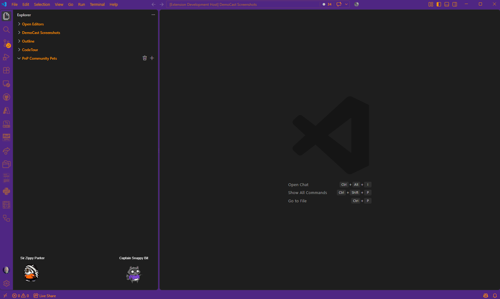
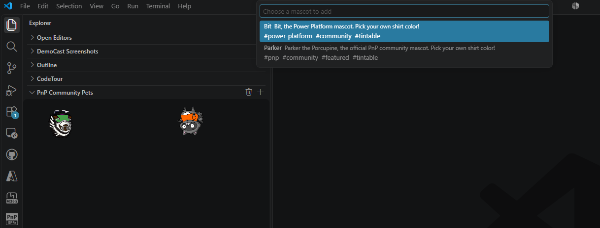
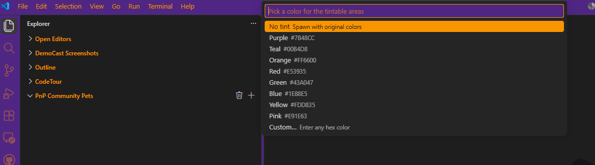
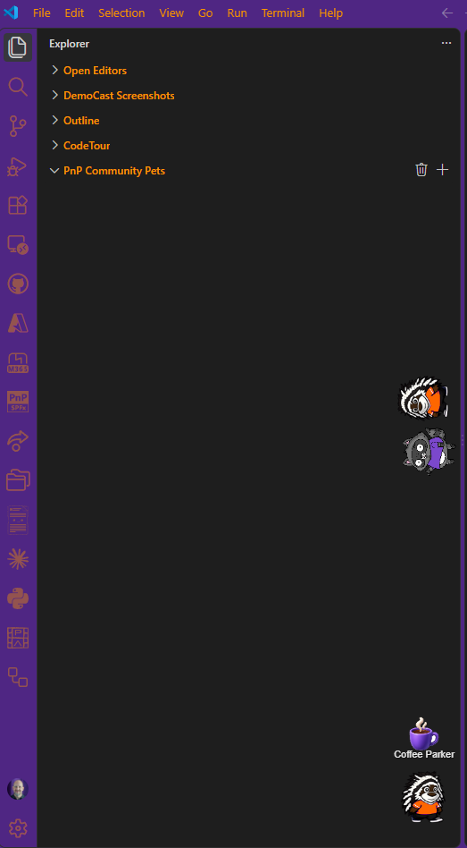
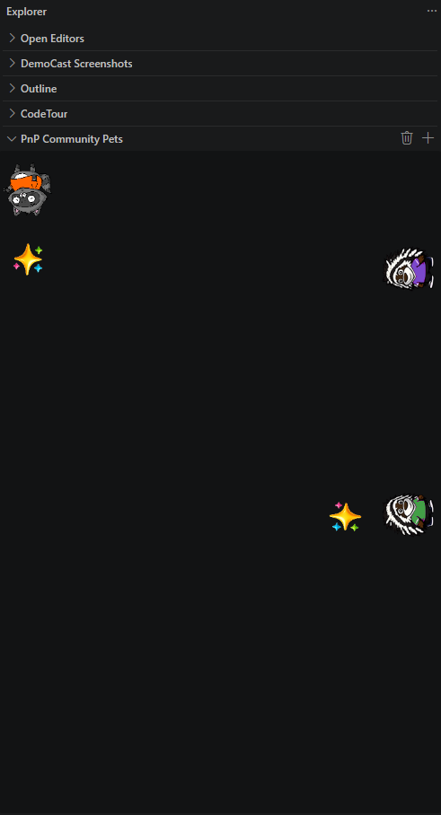
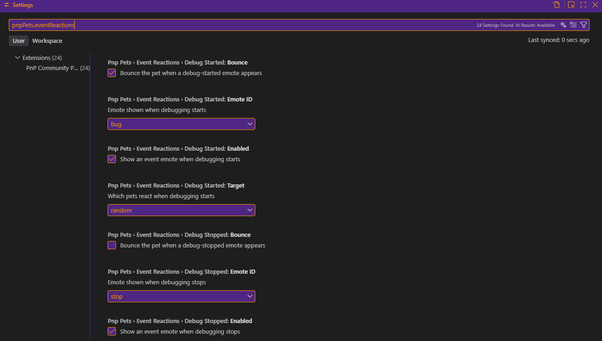

# PnP Community Pets

Parker the Porcupine, Bit, and more Copilot, Microsoft 365 & Power Platform mascots living in your VS Code Explorer sidebar. They walk, climb, and idle around the panel, and react when you save a file, run a task, or start debugging.

## Features

- **Real community mascots**: Parker the Porcupine and Bit, with room for more community mascots
- **Pick your own color**: tintable mascots let you choose a shirt color from a preset palette or any custom hex value
- **Walks every surface**: floor, walls, and ceiling
- **Multiple pets at once**: spawn as many as you like, each with its own name and color
- **Remembers your pets**: they're restored automatically the next time you open VS Code
- **Individually manage each pet**: remove or speed up/slow down one specific pet without touching the rest, from the Command Palette
- **Click a pet to say hi**: gives a little bounce; on walls and ceiling it hops away from the surface, matching its rotation
- **Event reaction emotes**: pets can react when files are saved, terminals open, tasks finish, or debugging starts and stops
- **Pet-to-pet interactions**: pets that meet on the floor can pause, bounce, and share an emote together
- **Seasonal themes**: background themes for holidays and community events
- **No-code contribution model**: add a new mascot or emote with a JSON file and some art, no code required

## Screenshots

### Spawn a pet

### Pick a color

### Click emote

### Event reaction

## Getting Started

1. Install the extension
2. Open the Explorer sidebar. The **PnP Community Pets** panel appears at the bottom
3. Click the `+` icon to spawn a pet, give it a name, and (for tintable mascots) pick a color
4. Click the trash icon to remove all pets
5. Open the Command Palette (`Ctrl+Shift+P`) for more: **Remove a Pet** or **Adjust Pet Speed**

## Settings

| Setting | Default | Description |
|---|---|---|
| `pnpPets.mascot` | `parker` | The mascot spawned automatically on startup |
| `pnpPets.theme` | `auto` | Background theme (`auto`, `default`, `winter`, `spring`, `halloween`, `ignite`, `build`) |
| `pnpPets.speed` | `2` | Movement speed (1–10) |
| `pnpPets.petCount` | `1` | Number of pets spawned automatically on startup |
| `pnpPets.persistPets` | `true` | Remember active pets across VS Code restarts |
| `pnpPets.enableEventReactions` | `true` | Enable temporary event emotes for VS Code activity |

### Event Reaction Settings

Each supported event has its own settings group under `pnpPets.eventReactions.<event>`.

Supported events:

- `fileSaved`
- `taskSucceeded`
- `taskFailed`
- `terminalOpened`
- `debugStarted`
- `debugStopped`

Each event supports:

- `enabled`: turn that event reaction on or off
- `emoteId`: choose one of the bundled emotes
- `target`: `random` for one active pet, or `all` for every active pet
- `bounce`: whether the pet bounces when the event emote appears

## Contributing Assets

Adding a new mascot or emote is a no-code contribution: drop a folder with a JSON manifest and your art under `media/pets/` or `media/emotes/`. See [CONTRIBUTING.md](CONTRIBUTING.md) for the full guide, supported sprite formats, and asset templates.

Badge signs and Credly profile integrations are planned for a future release.

## About This Pet Project

Yes, that's the joke. This is a genuine pet project, a fun side build, and it's not finished. The core walking-around-your-sidebar part works well, but there's more to do: more mascots, more emotes, the badge/Credly stuff that's built but not turned on yet, and probably a rough edge or two in the code that a fresh pair of eyes would spot in about five seconds.

If any of that sounds fun to poke at, contributions are genuinely welcome, no prior experience with the codebase required. See [CONTRIBUTING.md](CONTRIBUTING.md) to get started, or [BACKLOG.md](BACKLOG.md) below for a running list of what's planned.

## Roadmap

See [BACKLOG.md](BACKLOG.md) for planned features and ways to get involved.

## License

MIT
